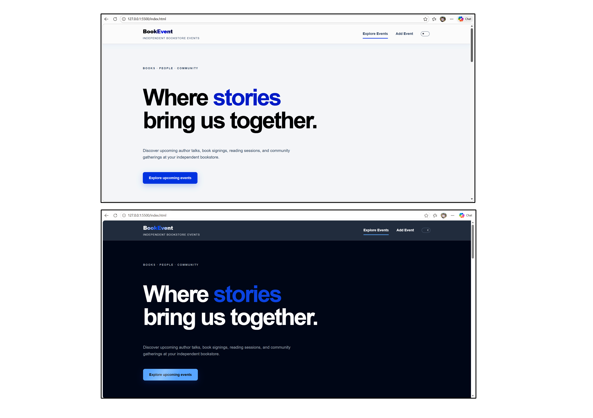
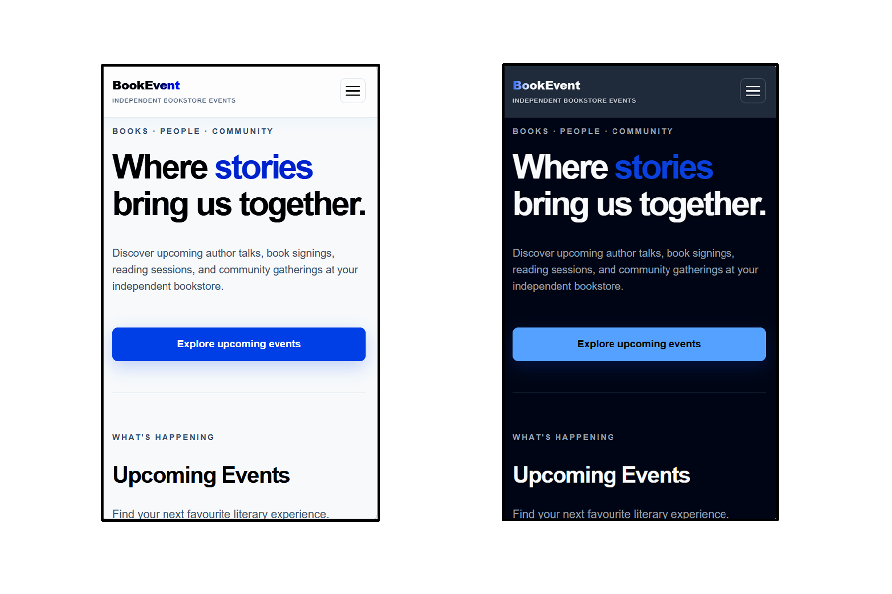
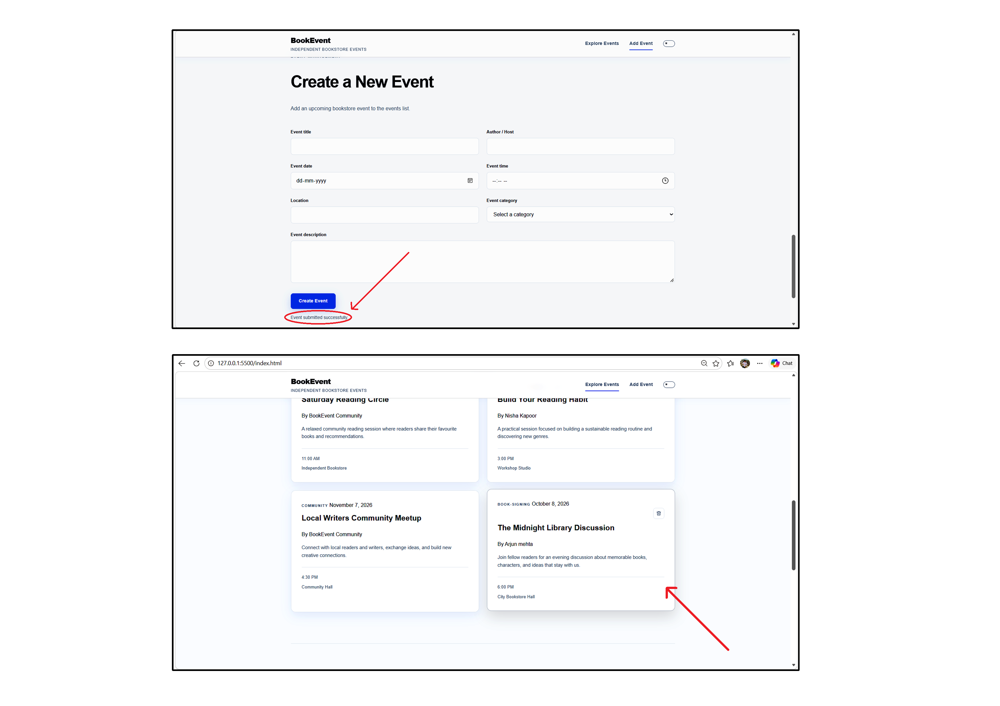
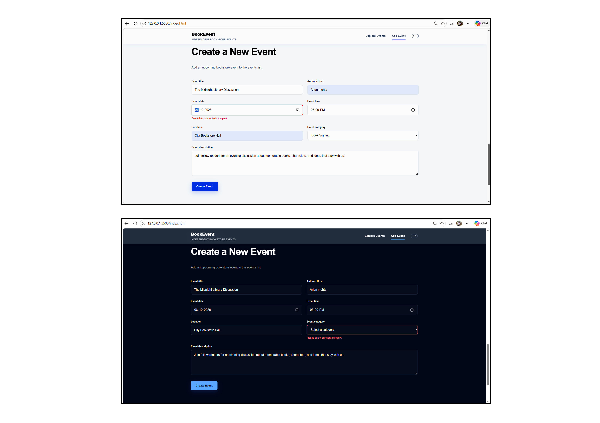
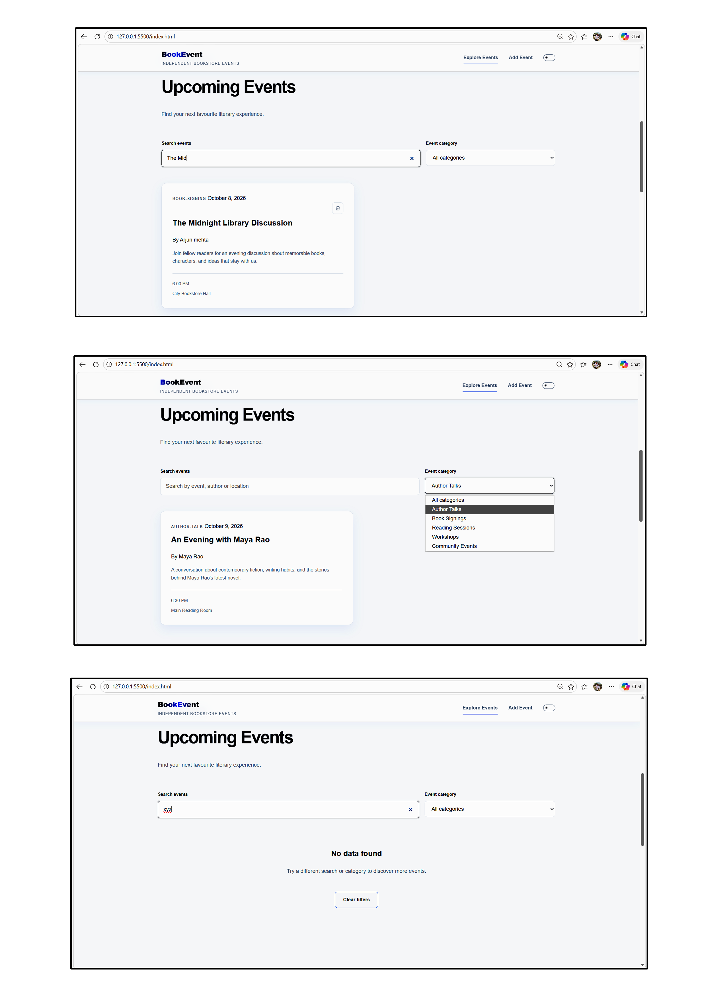

# BookEvent — Independent Bookstore Events Page

A responsive single-page web application built with HTML5, Vanilla CSS, and Vanilla JavaScript for managing and exploring independent bookstore events, with search, filtering, event creation, validation, persistence, and responsive theme support.

## Live Website

https://independent-bookstore-events.netlify.app/

## Features

### Event Discovery:

Displays upcoming bookstore events with event details including title, author, date, time, location, category, and description.

### Event Search & Filtering:

Search events by title, author, description, date, location, or category with an additional category filter.

### Create Event:

Allows users to create new bookstore events with title, author, date, time, location, category, and description fields.

### Form Validation:

Validates individual form fields, prevents invalid submissions, and displays field-level error messages with visual error states.

### Event Persistence:

Stores newly created events in localStorage so user-created events remain available after page reloads.

### Event Management:

Allows user-created events to be deleted while protecting the default event data.

### Empty & Loading States:

Provides a loading indicator and a clear "No data found" state when search or filter results are unavailable.

### Theme Support:

Provides Light and Dark mode switching with persistent theme selection across page reloads.

### Responsive UI & Navigation:

Responsive layout with sticky frosted-glass header, mobile hamburger navigation, smooth interactions, responsive event cards, and mobile-friendly form controls.
Optimized for desktop, tablet, and mobile screen sizes.

### Accessibility:

Built with semantic HTML, accessible labels, keyboard-friendly controls, focus states, ARIA attributes, and reduced-motion support.

### Security:

User-entered text is sanitized before being stored and escaped before being rendered to help prevent XSS.

### Edge Cases:

Handles empty search results, invalid form inputs, and client-side event persistence without crashing.

### Analytics:

Logs the required user interaction message after successful primary event creation.

## Tech Stack

HTML5 (Semantic Markup & Accessible Structure)

Vanilla CSS3 (Custom Properties, Flexbox, Grid, Responsive Design, Frosted Glass Effects, Animations)

JavaScript (ES6+) (DOM Manipulation, Form Validation, Filtering, localStorage)

Browser localStorage (Client-side Event Persistence)

## Project Structure

independent-bookstore-events/
├── public/
│   └── screenshots/
│       ├── desktop.png
│       ├── mobile.png
│       ├── event-management.png
│       ├── form-validation.png
│       └── search-filter.png
├── assets/
│   ├── icons/
│   └── images/
├── css/
│   └── styles.css
├── js/
│   └── script.js
├── .gitignore
├── index.html
└── README.md

## Project Screenshots

### Desktop View:

### Mobile View:

### Event Management:

### Form Validation:

### Search & Filtering:

